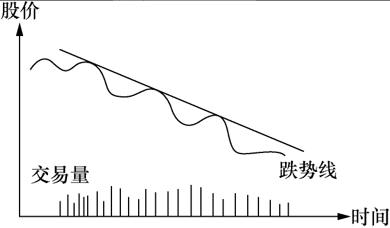

# 引言：故事三则
1. 年轻人
    - 不要怕
    - 不要悔
2. 赌博
    - 玩游戏之间先搞清楚游戏规则
    - 面对人为操纵的赌局一定要摸清对方的心里
3. 小偷
    - 小偷的本事不在偷而在危急的时候怎么逃
---
# 一、炒股的挑战
### 市场的挑战
1. 充满诱惑
   - 现象：给炒股者提供了无限的幻想
   - 应对：？
2. 大出所料的损失
   - 现象：股市没有明确的终止，买入后什么都不做，也能使你的亏损不断增加。
   - 应对：设好止损、坚决执行
### 方法的挑战
1. 炒股不是科学
   - 现象：变动从不重复、只是相似
   - 应对：
     - 用哲学和艺术的思维思考
     - 做大概率的事
### 人性的挑战
1. 时刻面临行动选择
   - 现象：股市没有开始和结束，想了要去做
   - 应对：
     - 自己做理性决定
     - 自己坚决执行（行动）
     - 自己承担全部的责任
2. 好贪小便宜、吃不得小亏、心怀侥幸
   - 现象：
     - 贪便宜：升了一点，迫不及待脱手。
     - 吃不得小亏：跌了不肯止损。
     - 心怀侥幸：幻想各种理由，说服自己下跌只是暂时的。
   - 应对：坚决执行止损
3. 讨厌风险
   - 现象：升了一点，迫不及待脱手。
   - 应对：理性分析和预测，坚决执行止盈。？
4. 自以为是
   - 现象：太固执己见，对自己的分析抱太大信心。
   - 应对：
     - 认真观察股市，不对时就认错（止损）。
     - 选择赚钱，而不是选择正确。
5. 赶潮跟风
   - 现象：
     - 跟随“领袖”，越过了做决定的横杠，如果结果是失败的，他们也有了替罪羊。
     - 不愿自己做决定，不想承担失败的后果。
   - 应对：不断学习，建立自己对市场的感觉。
6. 因循守旧
   - 现象：面对不一样的波动，失去方向，感觉渺小、孤独、无助。
   - 应对：找感觉，按规律和特点指引你行动，超过50%概率就不错了。
7. 耿于报复
   - 现象：跌了你就再多买一点，因为第二次买的价钱较上次为低，所以平均进价摊低。
8. 迟疑不决、心怀侥幸
   - 现象：到了止损点，仍想再等等或许就反弹了
   - 应对：定好规矩，坚决执行。
9.  发财心切
   - 现象：
     - 懂了一点后，每次入市开始期待“这只股将改变我的生活方式”。
     - 尽量收集对自己有利的消息忽视不利的消息。
   - 应对：降低预期？
### 应对挑战办法
1. 锲而不舍的精神。
2. 战胜自己的勇气。
---
# 二、股票分析的基本知识
1. 技术分析：股价、时间、交易量间的相互关系。
2. 基本面分析：除了技术分析外都是基本面分析。
   - 主要分析公司的小环境。
   - 大环境的情况太过复杂，判断大环境主要用“股票的大市”。股票的大市即股市的大趋势如何。
3. 不要将两种分析完全分割开它们其实是互相关联的。要想炒股成功判定大市的能力必不可少。
4. 注意
   - 人人都已将资金投入股市股市继续升高的推动力就枯竭了。
   - 大众恐惧的时候则该卖的都已经卖了股票也差不多跌到头了。
---
## 2.1基本面分析
### 大环境
1. 利率
   - 利率升高
     - 社会游资数目一定，钱存入银行的引力增加，流入股市的资金流减少。
     - 公司的借贷成本增加，盈利减少。其净结果都是股价承受卖压。
   - 利率降低时效果正好相反。
2. 税收
   - 企业税增加，企业盈利中的税务支出增加，使得实际盈利减少，股价将往下调整。
3. 汇率
   - 当汇率上调，本国货币升值，增加出口困难，营业额降低，其结果对股价的影响主要是负面的。
4. 银根松紧
   - 银根松时市场游资增多对股票的影响是正面的。银根紧时正好相反。
5. 经济周期
   - 经济周期是市场经济的必然结果。
6. 通货膨胀
   - 通货膨胀对股价的影响很难估量，通常政府为了控制通货膨胀会调高利息，对股价的影响主要是负面的。
7. 政治环境
   - 大规模的政治动乱必然带来大规模的经济混乱。战争、政府的频繁更迭、政局的不稳定对股票的影响是负面的。
8. 政府的产业政策
   - 政府鼓励某些行业给予扶持，如在税收上给予减免，融资上给予方便，企业各方面的要求都给予协助，结果自然对股价有正面影响。
### 小环境
1. 营业收入
   - 一个具有发展潜力的公司其营业收入必须有快速发展的势头。
2. 盈利
   - 有些公司做很多生意就是不赚钱。
3. 固定资产
   - 固定资产就是公司现有的所有“不动”的资产。
4. 类似公司的情况（同行业板块）
   - 大家都生产类似产品如电视机，其他公司的绩效和这家公司比怎么样，同类公司通常有类似的经济周期股价的波动也类似。
5. 品牌的价值
   - 你打算投资的这家公司有无过硬的品牌这可能对股价有深远的影响。
### 上涨的三个因素（个股基本面）
1. 盈利的增长
   - 一个健康、发展迅速的公司其盈利必定逐年增长。
   - 盈利增长的速度必须建立在合理的数字上。
   - 盈利增长的前提是销售收入的增长。
   - 另外必须留意的是销售收入增长速度和盈利增长速度的关系。
   - 最使市场注目的是盈利的加速增长。
2. 新产品
   - 新产品并不局限于“实物”，可以是新的生意概念新的推销手法新的管理方式。

3. 公司回购自身股票
   - 公司回购自身股票，这是好消息。
4. 股票流通数目
   - 公司股票总流通量的数目数目越大股票上升的步伐就越难迈开，因为需要大的买压才能推动价格上升。
---
## 2.2技术分析的基本知识
1. 技术分析的心理基础是建立在人性相近这一假设之上的。这个假设成立但并不完美。
2. 人是极其复杂的，股价变动虽然反映了投资大众集体思想和行动的结果，但它不可能完全地重复。所以说炒股是门艺术不是科学。
3. 股票的运动图像可以说是钱推出来的。不管别人嘴上说什么，我们看钱怎么走，名嘴们可以在股价高位忽悠大家买股自己卖，这会在技术图形上显现出来。
### 常用图形介绍
1. 用来判断股票运动是否正常的指标。
2. 在这些图的后面其实是股民们对该股票价格认定的心理变化。
3. 你要用心来感受:如果你是股市的一员你会怎么想你会怎样做这样你慢慢地就会形成何时入市、何时出场的直觉。
#### 股票的走势及走势线
1. 升势图  
   -   
   - 特点
     - 每个波动的最高点较上个波动为高最低点也较上一最低点为高。
     - 在上升阶段交易量增加下调阶段交易量减少。
   - 心理原因
     - 一般投资者入场买股票主要不是因为股票的成本收益比率低或红利高，而是因为股票在升升升。
     - 除了股票在升的理由之外其他因素都是次要的。这就是为什么股票一开始升势它往上一波高过一波不会马上停止。
2. 跌势图  
   -   
   - 特点
     - 跌波的每个波峰较上一波峰为低波谷也较上一波谷为低。
     - 在跌势时交易量没有特别之处。
   - 心理原因
     - 投资人卖股票的最主要原因是因为股票在跌在跌，而不是因为成本收益比率高和其他原因。这就是为何跌势一开始不会马上停止。
3. 无势图  
   -   
   - 无势的股票通常不适合炒作。
   - 特点
     - 根本不知道股票的大方向
     - 交易量也没有特殊
#### 支撑线和阻力线
1.   
2. 特点
   - 当股票在一定的区间波动。
   - 把最高点相连便成阻力线。
   - 把最低点相连便成支撑线。
3. 打破过程
  - 或迟或早有人会对这个价格区间持有不同看法，他们的行动将使买卖的力量失去均衡。
  - 如果他们的力量够大的话将引起一连串的反应。
4. 转换
  - 阻力线一旦被突破便成了新的支撑线。
    - 买方心里：刚买入，不赚钱是不会走的，卖压不大。？
  - 支撑线一旦跌破便成了新的阻力线。
    - 卖方心理：跌破支撑线又回升支撑线，现在终于有不亏或小赚的机会，快卖掉结束噩梦。对这个烫伤价位记忆犹新，也不敢再买。
#### 双肩图和头肩图
1. 双肩图  
   -   
   -   
   - 特点
     - 两个高点。
     - 高点的选择和时间跨度相关，但成因相同。
   - 买家心理：随着价格升高买主们怀疑是否能穿过原来的最高点。（右肩）
   - 卖家心里：卖主们也观察这个最高点是否还能像上次一样带来卖压使得升势受到挫折。（右肩）
   - 未穿：无法穿过上次高点，市场对价格的看法产生变化，价格逐步滑落。
   - 穿过：买力不减，回到升势图。
2. 头肩图  
   -   
   -   
   - 买家心理：？
   - 买家心理：？
#### 平均线
1. 200天平均线来衡量股票的长期走势。
2. 50天平均线来衡量中期走势。
3. 股票短期的运动方向注重股价及交易量。
4. 通常不买股价在200天平均线下的股票，做短线时例外。
#### 其他图形
1. 指标都有“见光死”的特点。
2. 图形背后的心理因素、人性不容易改变，所以一直有效。
#### 综合看图
1. 综合走势线及阻力线和支撑线稍下的点是卖出点。支撑线一旦被突破表示升势结束。  
    -   
    -   
2. 倒过来我们就有了最常见的买入理想点。记住如果这是升势开始的话交易量通常增大。  
    -   
3. 这是我们在炒股中常见的股票运动图。我标出了各个不同的买入及卖出好点。请读者用心体会一下为什么。这些买卖点其实还可以改进。  
    - 
### 股票的正常运动和周期性运动
#### 正常运动
1. 走势和走势线
   - 升势：正常，每个高点越来越高，低点越来越高。
   - 跌势：正常，每个高点越来越低，低点越来越低。
2. 支撑线和阻力线
   - 阻力线：正常，突破后继续上升，回调不应该跌过阻力线。
   - 支撑线：正常，跌破后继续下跌。
     - 一跌破支撑便反弹道支撑线之上，可能是买股的好时机。
3. 双肩和头肩
   -  正常，穿过突破点应该能够继续。
4. 平均线
   - 升势：正常，在200天之上波动。
   - 跌势：正常，在200天之下波动。
#### 股票的周期性运动
1.   
2. 股票运动大约分成四个时期
   - 蓄劲期：买卖双方的力量基本平衡。
   - 爬坡期：买压胜过卖压。
     - 真正的爬坡期：要有交易量增加的现象，股价一举突破阻力线。
   - 疲劳期：买压和卖压又基本持平。
   - 下坡期：卖压强过买压。
3. 在任何时期股票的波动都是波浪形的。每个大波动内包含有很多反向的小波动。平均线将中和这些小波动且指明大趋势。
4. 股市操纵可能改变每天的或短期的波动，但不可能改变大势。
5. 经济周期规律
   - 下坡期：上个周期末生产过剩，产品价格跌落，存货增加，公司盈利减少，股价下跌。
   - 蓄劲期：公司将不畅销的产品淘汰，减少存货，未经济复苏做准备。
   - 爬坡期：盈利增加，公众开始争购股票。
   - 疲劳期：因为竞争和市场饱和，产品过剩。
---
## 2.3股票分析只我见  
1. 分析可以提高股民入市的胜算率。
### 技术分析
1. 不要把技术分析孤立起来看。
   - 研究股票的大市
   - 研究公司的经营情况
   - 研究公司的产品
   - 再看股票的走势图
   - 特别还要注重交易量的变化
   - 只有在这个基础上技术分析才有意义。
2. 最重要的是记住止损。
### 股票的大市
1. 炒股的诀窍便是，在牛市中全力投入，在牛市结束或接近结束的时候卖掉你的所有股票。
2. 炒股是概率的游戏，逆大潮流而动你的获胜概率就被大打折扣了。大市不好时别买任何股票。
3. 要确定大市的走向最重要的是每天要追踪股票指数的运动。
4. 用技术分析的方法来判定大市的走向及走向的变动是最为有效的工具。
   - 研究股票指数图把它看成一只股票，看看这只股票是处于什么运动阶段，它运动正常吗。
   - 留意每天的交易总量。如果股市交易总量很大但指数不升或开盘走高收盘低收，这就给你危险信号了。
5. 当股市跌了很多，跌到大家都失去信心的时候。
   - 发现有一天股市狂升，可能升1或2，交易量很大，这往往是跌到底的信号大户开始入场了。
   - 但这还不是进场的最佳时机，被下跌套牢的股民可能趁这个反弹卖股离场。
   - 如果在此之后股票指数突破上一个波浪的最高点，你可以证实跌势基本结束是进场的时机了。从图上看这时应有升势时具备的特点。
6. 留意一下周围发生了什么事
   - 中央银行是否要调整利率。
   - 周边国家是否有动乱。
7. 判断股市大市还应注意下列几点
   - 1.大的政治环境和经济环境有什么变动。
     - 今天的企业越来越具全球性，其他国家发生的政治经济危机将会影响本国的市场。
   - 2.本国的经济大势怎么样，通货膨胀的情形如何，外汇兑换率有无变动的可能，中央银行会调整利率吗。
   - 3.所谓的股市龙头有什么表现
     - 在股市到顶之前你会发现，股市的龙头股在大市到顶之前的一段时间开始疲软。
   - 4.垃圾股有什么表现
     - 在股市到顶的前一段时间，一些平时没有人过问的小股票开始变得活跃且向上升。龙头股的价格已贵到不敢买的地步社会游资便开始涌向三四线股票。
   - 5.每天收盘的时候有多少只升的股票有多少只跌的股票。
     - 综合指数有时会被几只大股票糊弄。综合指数不完全反映大市的真实走向。
   - 6.考虑类别股。
     - 虽然大市的综合指数走升势，其中某些类别可能在走跌势。研究大市走向时应将类别综合考虑。
     - 炒手们应根据类别股的运动形态来决定具体某只股票的买卖。
---
## 2.4什么是合理的价位
1. 太离谱的股价有时会出现但通常不会维持很久。
2. 机械化生产使得价值的判断变复杂了。
3. 现今流行的企业评估标尺如本利比、现金值、固定资产值等，是用来评估工业社会企业的。它取代了农业社会丈量土地的方法，但用它来评估信息社会的企业可能并不十分合适。
    - 近年来网络股的大起大落，在一定程度上便是，社会不知怎么合理评估这些新型企业的价值在金融市场的反应。