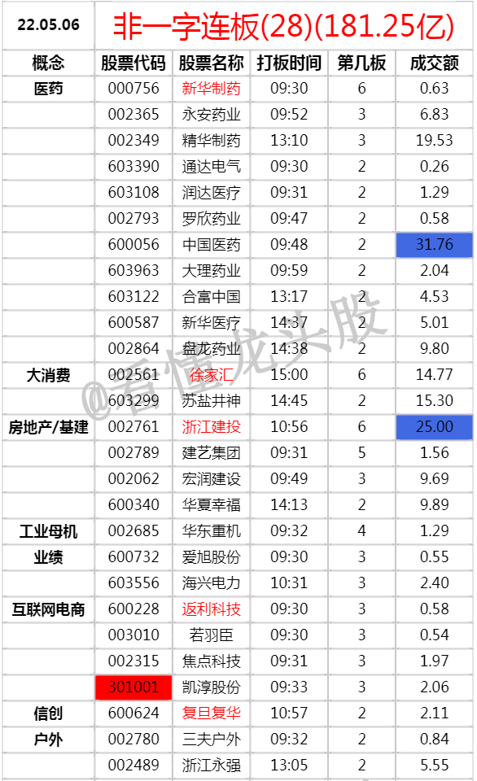
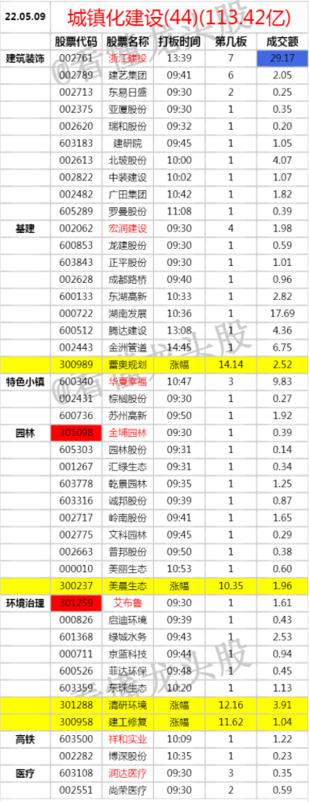

# 做接力的预期问题
1. 如果只奔着当天能封住涨停板去的，那么长期来看这是负EV的。
    - 胜率：每天的龙头股晋级率（继续连板）长期肯定是低于50%的，甚至是低于30%。
    - 赔率：晋级失败后（没连板）亏损很大，至少计提10个点以上。
    - 如果只奔着当天能封涨停，那选择标的会很多。
2. 要奔着至少要能再躺一个涨停板去买。
    - 它能成为最强板块的最强龙头，最差是成为支线龙头，从而享受溢价。
    - 大行情里的跟风补涨。
# 真正的交易高手模式不会太刚
1. 比如今天可以做，但连板不是特别好，趋势效应好，就做趋势，而不是硬做连板。

# 接力复盘
1. 复盘内容：当日连板股票池。
2. 思考内容：
    - 做高标接力。
    - 做高低切。
    - 做高低切，是做主线板块的补涨，还是做新题材的龙头。
## 接力预期：高标
1. 高标要继续开拓空间，甚至进一步引爆板块。
2. 高标不一定纯指最高板的那一个。
    - 通常4板以上都算高标，或者涨停阵型的前3高度。因为逻辑最硬的高度标，不一定恰巧是当天的绝对最高标。
    - 举例：20220510高标：新华制药、湖南发展、建艺集团。
    - 浙江建投因为是换手票，所以排除掉。
    - 
    - 举例：20220519高标：索棱股份、中通客车。
    - 中迪投资，不大好，因为身位不够高，高低切又太高，是介于中间的东西，板块逻辑又不够强。
    - 
### 开拓空间有几种情况
1. 如果板块之前没怎么动过，那么是要带动板块高潮的。
    - 举例：20220519：索棱股份超预期连板，带动板块高潮。
    - 
    - 
    - 
2. 板块突然出现一波流题材转向主线题材预期，高标是首先要受益的。
    - 举例：20220509：消息利好城镇化，预期地产基建成为主线。
    - 20220509的发布政策：《到2025年，以县城为重要载体的城镇化建设取得重要进展——25项建设任务推动县城发展》
    - 
    - 
    - 
    - 
    - 

