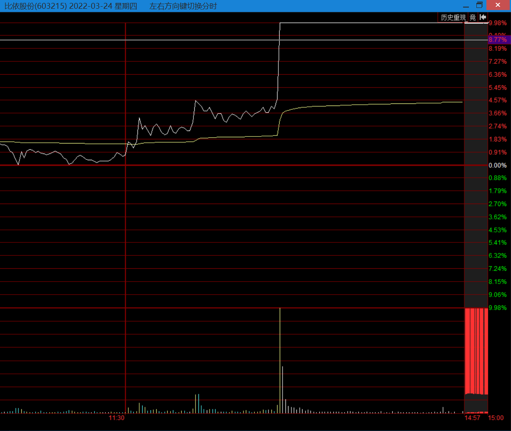
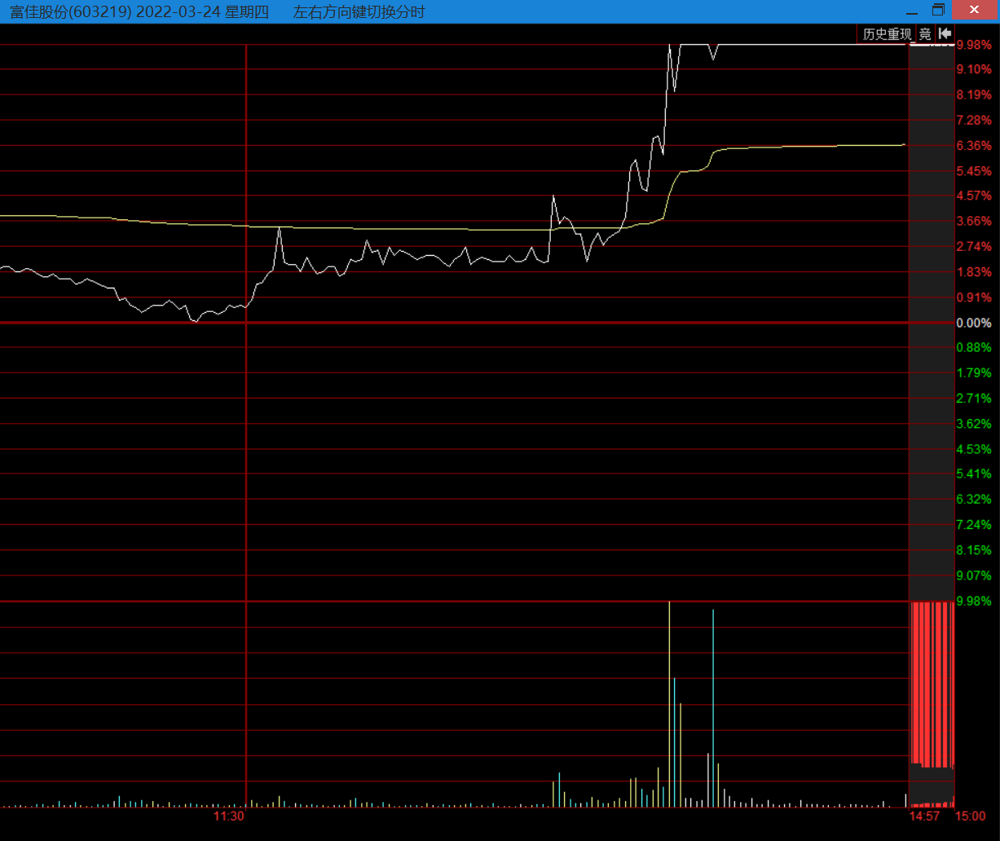
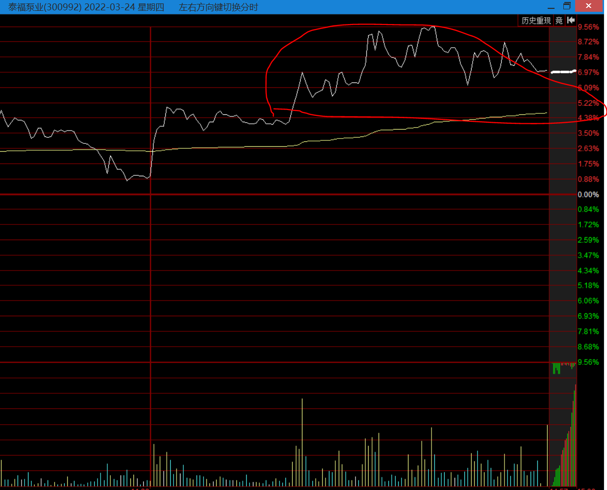
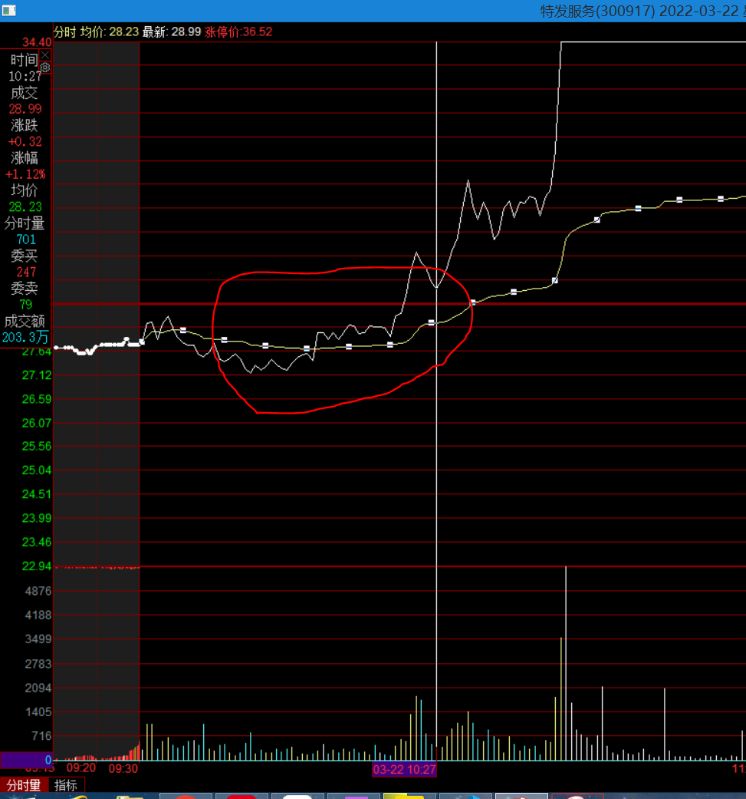

# 一、板块情绪周期具体有哪些阶段
1. 启动：
2. 发酵：续着之前的涨停班，继续连板，同时带动了板块内更大的联动。动静更大。
3. 高潮：板块彻底全面爆发，几乎所有人都注意到它了。
4. 分歧：所有人都找到它了，它的看涨预期格外的强，但板块中却出现了一些个股已经开始冲高回落，板块整体出现滞涨。
5. 衰退：板块内的亏钱效应开始放大。
6. 结束：板块整体止跌消停了。
---
# 二、如何区分板块处于哪个阶段？
## 严格区分周期处于哪个阶段没有太大意义
1. 这些阶段其实是个感受，没有标准答案，也不能绝对量化。大概了解就好。
2. 纠缠是在启动、发酵、分歧、衰退或是其他的阶段没意义，因为分歧可能出现在情绪周期的任一阶段。
3. 分歧虽不结束情绪周期，但它扰乱情绪周期的正常进程。
4. 很多小题材发酵和高潮同一天就完成了，你没办法区分当天是发酵还是这个板块已经高潮了。
5. 是发酵还是高潮只有事后才知道，很多事情也是事后才能知道，一定要承认这一点。
6. 不是为了分清而分清，不要钻牛角尖，分辨这些阶段的初衷是为了赚钱。
7. 只要抓住大概率能让你赚钱的点就可以，这个点就是板块当下阶段与下个阶段的连接是什么。
8. 连接是当天可以看得到的，重要的是连接是否在加强。
## 不同情绪阶段连接的规律
1. 启动到发酵，两个阶段的连接是加强。
2. 发酵到高潮，两个阶段的连接是加强。
3. 高潮到分歧，两个阶段的连接是减弱。
4. 分歧到衰退，两个阶段的链接是减弱。
## 加强连接和减弱连接
1. 加强连接，板块情绪属于上升阶段。
2. 减弱连接，板块情绪属于下降阶段。
## 即将或正在处于加强
1. 即将：是一种还未发生，但是处于临界点的预判。 
2. 正在：是已经发生，但是还未结束的一种跟随。
## 基于板块情绪周期交易模式的方法论
1. 大前提：只有板块联动加强才值得买入。
2. 板块给的最直接的信号
    - 只要加强了，第2天大概率会加速。
    - 加强之后意味着加速，加速之后要更加加强才能买，否则就变成分化中的龙头博弈。
    - 加速阶段的龙头博弈，不值得参与，成了挣不了多少，亏却能亏特别多。
3. 板块涨且是加强连接，当天买入后的2种正确表现（大概率）
    - 当天就有浮盈。
    - 或第2天会有一个很容易的高开溢价，而不是去熬1个分时高点。
## 一个案例：建筑节能板块
1. 3.15：板块的初步启动阶段
    - 零星的几个涨停板，北玻股份，柯利达，建研设计
2. 3.16：板块进一步联动发酵
    - 板块联动加强没有那么明显，但已经有一点板块的规模开始变大
    - 北玻股份一字板，柯利达T板，耀皮玻璃首板，300次新票晶雪节能底部大涨9个点
3. 3.17：分化、分歧状态（开盘没有按套路继续加强高潮）
    - 北玻股份、柯利达一字开，晶雪节能秒板，没有其他首板。
    - 昨日那么好的板耀皮玻璃直接高开回落，而且是开盘回落。
    - 板块也没有其他个股出现快速走强的情况。
    - 只从买入的角度看，只要看板块是否加强，就可以决定是否参与，板块不是加强的，晶雪节能是有叠加300次新博弈的逻辑。
    - 下午，指数冲高回落被带跨，板块内的老二柯利一字炸板，面巨大无比。
4. 3.18：合理位置的弱转强
    - 18号市场盘面结构
      - 17号市场总体走势处于反弹后的首次分歧。
      - 18号市场开盘比想象中的要强很多，有向上的预期，相当于大盘有个共振点。
    - 北玻股份
      - 18号巨量分歧涨停板开盘，这是一种独立于板块之外的龙头股模式，类似叠加了其他模式。
    - 整个板块
      - 17号首次分歧后，按道理板块应该开的比较低
      - 开盘北玻股份巨量秒封一字
      - 板块发生极为强势的联动，板块内个股秒冲板，晶雪节能秒冲板，耀皮玻璃3天2板，先锋新材等都秒冲板。
      - 是典型的加强型启动，加强型启动当天就可以干了。
5. 3.21：板块分歧、分化（板块回落没有继续加强）
    - 无论板块是涨停潮启动，或者是板块处于涨停高潮的阶段。第2天板块大概率是回落的。
    - 回落是大概率的，无非是分强中回落或者是全面回落。
    - 分歧、分化，前排开始加速，后排开始掉队，是持股者的盛宴，此时不适合买入。
6. 3.22：板块衰退
## 案例总结
1. 17号板块整体处于刚刚启动发酵的初步分歧阶段，这是个很小级别的，本身波动不大，没有大规模涨停潮高潮，很难严格按照阶段划分。也很难说是不是周期已经结束。
2. 18号可以说是继15号后的高潮，也可以说是新周期的涨停潮式的启动，这都不冲突，但可以确定1点，加强型启动当天就可以干了。所以说要看连接，而不是看板块处于具体的某个阶段。
3. 3.18为什么集合预判可以干北玻股份？
        - 这是属于大市卡龙头股的交易模式，先简单提下，以后会讲到。
        - 当时格局是处于市场整体分歧后的再启动。
        - 如果此时一个票用非常强势的盘口表露强势，且它有身位的话，是很容成为高标潜质的，卡的时间特别好。
4. 分歧可能出现在情绪周期的任何一个阶段，它不结束情绪周期，但它扰乱情绪周期的正常进程。
    - 3.15号启动，3.16号发酵，3.17号按道理要高潮，结果板块没有联动加强，变成了分歧，3.18号没有继续分歧，而是弱转强。
## 新手常犯的错误及纠正：买在加强后
1. 如果已经发生了，已经加强了，那意味着加强快结束了。
2. 很多新手喜欢在这个阶段买入，往往就是追高后排，被涨跌绑架，买在已经发生后，依然亏钱，原因就在于。
3. 事物的判断要用发展的眼光去看，对待股市也是这样，要用发展的眼光去看待。
4. 做交易要用发展的逻辑去买入，当下涨不代表能接着涨，你得判断还能接着涨才值得去买。
5. 判断接着涨就是周期连接的问题。
---
# 三、在板块情绪周期的各个阶段该怎么用对应的交易模式买票
## 概述
1. 首先，交易模式有非常多，很多都是叠加模式，尤其龙头股。
2. 其次，事先知道逻辑，准备好股票。
    - 提前把板块都弄好，有助于迅速找到对应交易模式。   
    - 把有预期的，可能爆发的板块先建立好股票池。
    - 越是预期强，股票池越要做的精细。
    - 大部分功夫是花在盘前，盘中只要看下联动，找个对应交易模式买。
    - 盘中突发做应对，再牛也没办法。
3. 再次，股票交易是盈利确定性与买入性价比的平衡，每个人是不一样
    - 水平高，需要的确定性的信号少，水平低，需要的确定性的信号多。
    - 需要确定性的信号越多，滞后性越强，买到的票越次。
### 准备股票池的案例
1. 20220324：关税股票池异动
2. 20220325盘前：准备3个股票池
    - 关税整体股票池
    - 叠加次新股票池
    - 叠加跨境电商股票池（延伸支线）
3. 20220325集合竞价
    - 整体关税开的还不错，没有特别强。
    - 次新两个一字板（富佳股份、万控制造），次新太强了。
    - 跨境电商支线，龙头股份开的最好，就可以博弈支线龙头。
    - 集合竞价买入龙头股份。
---
# 四、启动阶段
## 小规模启动
1. 有无联动埋伏模式、小型联动模式、大型联动模式，但不管哪一种都要有逻辑准备和大盘环境支撑。
### 逻辑准备
1. 事先知道逻辑，觉得逻辑有发展和发酵空间，提前准备好板块股票池。
### 大盘环境
1. 大盘短期没有明显大异动预期（没有暴涨或暴跌）
2. 暴跌不用讲，但暴涨也不好。因为大盘如果有暴涨预期，但这个板块有逻辑却不涨，说明逻辑有些弱了。
### A.无联动埋伏模式
#### 板块环境条件 
1. 开盘板块没有异动的迹象。
#### 选股条件
1. 选图形处于没有下跌预期的走势，超跌后的止跌是最好的。
2. 选逻辑最正的，股性最好的。
#### 操作
1. 买点：分时上一定要跌下来了，觉得跌不动了，再做低吸，为赚正常波动埋下基础，不能看分时涨了再去追。
2. 周期：不能恋战，最多3天。当天买入后板块没发酵，第2天板块还是没发酵最好就走，除非逻辑真的非常好，可以再看1天。 
3. 卖点：因为买时是低吸，第2天逻辑虽没发酵，但会有个正常波动，你赚了1个点，此时一定要走。
### B.小型联动模式 
#### 板块环境条件
1. 板块出现很少（2-4个票）的股票联动，或者没有联动。
#### 操作
1. 领头票的分时很强，可以考虑打板它。
2. 其次，如果领头票封出了很好的板，或者根据盘面情况，可以考虑找板块内比较有辨识度的票做低吸。
#### 案例1 久琪股份
1. 时间点：20220324开盘
2. 板块：开盘板块没有加强
3. 图形位置：20220323是处于超跌后的止跌状态
4. 逻辑：当天出了大消息刺激，个股逻辑也不错。
5. 买点性价比：集合竞价高开了很多有6个点，但基于性价比不要去追它，要买也要挂单低吸。
6. 卖点：大盘跳水，板块分歧走弱，个股也已经有盈利，卖了止盈。
#### 案例2 泰福泵业
1. 时间点：20220324开盘
2. 买点性价比：后排票，上午挂单低吸，如果拉升千万不要追。
3. 卖点：本身是后排票，盘中互动易实锤属于关税减免，拉升后开始又开始回落，有盈利就该卖掉。
### C.大型联动模式
#### 大型的标准 
1. 板块股票池内很多票（5个起步）都产生了向上涨幅。
#### 完全启动式的大型联动（特别难做）
1. 之前没有启动、没有任何异动。
2. 基本上是由于盘前有利好消息，开盘板块就开始大型联动。
3. 好票你买不到，如果不基于信价比，买到的往往是脉冲后的巨坑，所以开盘可以先观察15分钟，是否会冲高回落。
4. 利好驱动的板块的第1次联动，情绪大于价值，是预判类的操作，一定要做性价比。
#### 第1种模式
##### 板块
1. 板块还没封住，还在联动。
##### 选票操作
1. 打最领头的龙头板或者最前排的票。
2. 涨停顺序为1到3，一字的也要算在内，再往后就不要了。
3. 比手速、反应、缘分。
4. 禁忌：千万不要买（前3之外）高开9个点的换手跟风后排，这笔交易没有防守性。
#### 第2种模式
##### 板块
1. 板块明确封住，确认没有回落，且板块有联动走强迹象。
##### 选票操作
1. 找一个有辨识度的个股低吸。
##### 案例（叠加300套利低吸）
1. 时间点：20220322/10:00-10:15，地产板块明确走强。
2. 逻辑：地产板块走强，低吸延伸线的300套利票。
3. 个股：300套利的特发服务。
4. 买点：10:15-10:27，在水下以及第一波拉升后的低点，是有足够多的时间低吸，之后就不要参与。
5. 卖点：第2天开盘，地产板块回落，开盘就可以卖了。本身就是后排票套利票，也有盈利了，卖掉。
#### 第3种模式（3种模式中最好的机会）
##### 板块
1. 板块早上一波走强，然后回落或者盘整。下午出现再一波联动转强。
##### 选票操作
1. 此时出现的大量首板票。
##### 案例（叠加次新套利低吸）
1. 时间点：20220324，关税板块，上午基于消息封住了几个板其他没有太强的联动，下午板块突然走强。
2. 逻辑：关税板块加强，叠加次新、300逻辑的票。
3. 个股：前排的比依股份，后排富佳股份。
4. 买点：下午板块加强，前排的比依股份可以打板，后排的富佳股份要低吸（基于性价比）。
5. 禁忌：下午板块加强，泰富泵业已经涨了6、7个点了，不能低吸，因为没有性价比，宁愿错过也不要买。

#### 喜欢追高的心里
1. 你其实也知道这是后排，板块走强之后你怕错过，内心深处有侥幸心里， 怕万一明天继续强，这种侥幸心理诱惑太大导致追高，但都是亏钱，复盘哥这样亏了1辆法拉利。
---
# 五、发酵阶段
## 启动时的前提
1. 板块启动时没有涨停潮，属于小联动，零星涨停。且板块逻辑很不错。
## 板块无加强模式（出于逻辑）
### 板块
1. 板块虽然没有加强，但逻辑上预判认为很不错。
### 龙头表现
1. 龙头走的也不错，没有跌之类的在4、5个点震荡。
### 买点
1. 分时低吸龙头。
2. 打板龙头，是传统的二板定龙头。
## 板块联动加强模式（处于板块联动加强）
### 板块
1. 开盘或者盘中联动加强（比昨天启动期，联动的股票数量要多）。
### 买点
1. 直接追龙头，打板龙头。
2. 联动特别强，打板前排。
3. 低吸有叠加逻辑的个股。
4. 禁忌：不要追高后排。
## 重要变数
1. 发酵阶段有可能直接到高潮，演变成日内涨停潮。
2. 板块不断加强，找一些中军，或者衍生逻辑，且还没怎么异动的票，去低吸。
3. 禁忌：追高板块大发酵，跟涨却涨不高的票。
## 案例（板块加强低吸后排）
1. 时间：202203018节能建筑板块，全天在加强。主要的牛逼点在10:30后就结束了。
2. 逻辑：旗滨集团逻辑正宗，日K图形位置好处于超跌止跌，低吸后排补涨跟风。
3. 买点：10:30左右分时在水上低吸，如果看好板块，尾盘回落也可以低吸。
4. 卖点：本身是后排票，20220321板块分化走弱，有盈利立马走人。
---
# 六、分歧弱转强之后的涨停高潮（极品交易机会）
## 前期情绪背景
1. 启动是突发式的，没有筹码沉淀，小规模的涨一波之后，还没有高潮，就陷入到分歧，紧接着弱转强。
## 逻辑
1. 因为开始涨了一小波，已经聚集起人气，然后开始回落，之后又出现弱转强，弱转强是爆发的征兆。超预期会非常强烈。
2. 此时已经不是龙头的独立机会，而是板块性质的加强。
3. 这个机会，是正向的、连续的、龙头模式主升浪的机会。
4. 做龙头亏亏赚赚，是因为对板块的情绪周期的理解不够到位。只有板块加强助力，龙头才会到位。（好比同样是清朝皇帝，国力强盛时康熙牛逼，而国力衰败的溥仪一生坎坷）
## 继续演进的结果
1. 前面走的不是很强，出现盘口弱转强，要有预期。
2. 表现形式是：一小波起来，分歧，弱转强，板块整体加强，再涨一波，又分歧，又弱转强，再涨一波。
3. 一直这样，板块不断的积累人气，分歧再爆发，直到走到足够高，板块就会在高位，此时哪怕高位涨不动也只会横盘，掉不下来，不会走A。
4. 这个过程需要各种各样的续命（比如不断的有消息放出），这就是从日K级别小题材，转变到周线级别的中线题材的过程。
## 交易模式
### 主观预期
1. 首先要对板块弱转强这个反转要有预期。
### 选股模式
1. 引领的龙头股打板，或者预判式的追（分时出现走强）。
2. 板块已经出现联动，一些有高度身位但还没拉的个股。
3. 低吸位置性价比合适的，叠加300逻辑套利票，叠加次新逻辑套利票。
### 禁忌
1. 板块已经明显走强（滞后的交易），不能追高分时上涨强度不强的后排票。
### 选票及买点总结（分歧弱转强之后的涨停高潮）
1. 引领板块，且能够打开高度预期的板。
2. 板块走强，有辨识度的票（300，叠加，连板身位）。
3. 一定要考虑性价比低吸，宁愿放弃也不要追高后排。
## 案例1（地产分歧弱转强）
1. 20220322，地产板块是一个卖掉，再买回来的过程。
### 大盘
1. 20220322，开盘大盘的情况很差，很多票都在跌。
    - 开盘宋都股份直接掉下来。
### 板块
1. 9点50左右开始反转。
    - 苏州高新，回封。
    - 阳光城，拉板。
    - 光大嘉宝，拉板。
2. 10点左右，板块开始走强。
3. 10点13左右，板块明确走强了。
### 选股（对照上面选股模式）
1. 阳光城（引领龙头股的打板或预判式的追）。
2. 广田集团（板块已经出现联动，一些有高度身位但还没拉的个股），10点13左右，板块明确走强。10:25还在水下-3%，且有辨识度身位（当时三板算是中间板）。
3. 特发服务（位置性价比合适的300套利），10:30还只在2%。

### 板块再启动时身位判断
1. 看市场市场的高标有没有打开的话，如果没有高标没有打开，市场向上的预期是不大的。
2. 所以板块再启动时，中间板的弱转强更好，有非常好的身位优势。
## 案例2（主线关税，支线跨境电商） 
1. 20220325，盘前已经做好计划，关税如果要加强，有可能会延伸到支线跨境电商板块。
### 逻辑
1. 没有任何1个行情，主线板块的后排会连续加速，主线板块进入高潮一定是分化。
2. 板块要继续走一定是通过衍生很多支线逻辑，通过支线走强来支撑板块的持续性。
### 板块强弱（20220325，主线关税，支线跨境电商）
1. 虽然个股久琪股份一字开，有些超预期，但主线关税板块在风化，没有走强。
2. 支线-跨境电商板块加强。
    - 龙头股份秒板。
    - 德邦股份拉板（高位有辨识度）。
    - 星徽股份拉板（300套利票）。
    - 天泽信息拉板。
    - 南极电商拉板。
### 集合竞价（20220325）
1. 华升股份一字（昨日时间龙头）。
2. 久琪股份一字开。
3. 富佳股份一字开（次新逻辑）。
4. 龙头股份，高开5个点，且昨日拉板较早。
### 禁忌
1. 巨星股份，不值得集合竞价追，顶多板块加强，基于信价比低吸。
2. 德昌股份，虽然是跨境电商中后排开的最好的，高开9个点，但在次新逻辑中它才排老三。
    - 如果板块走强还可以，但如果板块不行，开盘即有炸板可能。
    - 花9个点买次新支线的老三，没有性价比。
3. 次新不要买加速、后排、接力，基本是波动大且亏得很惨的结果，20-30点起步。
    - 次新股没有基本面逻辑，纯粹情绪炒新，大盘、情绪一走弱，死的最惨。都是前手吃后手的逻辑。
    - 玩次新最多在启动阶段买。
---
# 零散点记录
## 历史上板块爆发流程
1. 先小规模启动。
2. 龙头2板，跟风加大。
3. 龙头3板，走出身位。
4. 龙头4板，板块爆发。
5. 板块爆发多在龙头3、4板的时候。 
## 量化对板块爆发的影响
1. 量化含有“舆情因子”和“题材因子”，认为题材爆发时，当天就能造成所有类似相关的普涨。
## 低吸的宗旨
1. 长期来看，买的大多数股票逻辑都是不成功的，不会按我们逻辑预期走的。
2. 及时逻辑不按预期走，还能不亏甚至赚1个点走，长期积累就能有不小的盈利。
3. 但只有逻辑真有按预期的走，就能赚十几个点。
4. 保持大多数情况不亏或者微赚的关键点在于分时低吸。
5. 预判式的低吸，一定要保证股票本身没有大跌的预期，即使逻辑没有兑现的话也能正常走。
6. 很多低吸都是可买可不买，逻辑好且性价比好，可买，性价比不好，不买。
## 什么是分时联动？
1. 真正的分时小联动，领先的票往往是个小票。小票的分时是很流畅的，往往是有冲板预期的，是直接一波流拉升的。
2. 不是慢悠悠的或者脉冲一下的，这种没有买单连续性。
## 板块强弱判断误区
1. 龙头带不动板块，龙头自身有博弈逻辑，龙头走强和板块没关系。
2. 板块强不强要看板块联动强不强，板块联动强，后排才值得看。
## 交易机会的判断
1. 时间：20220327
2. 市场背景：市场刚暴跌过一批，有很多好票处于超跌后止跌的位置。
3. 逻辑：板块走强，个股即使没怎么涨也不会跌，因为个股已经超跌过。
4. 买点：个股超跌后处于止跌状态，板块走强，不要追高，基于性价比低吸后排。
5. 卖点：本身是后排票，不要预期太高，板块走弱，有盈利就卖掉，有赚就跑。
## 个股博弈判断误区
1. 板块大趋势可以预判。
2. 个股之间的相互卡位，相互博弈，有很多的资金因素在，没法预判，有很强的随机性在里面。
## 新手买票要注意的点
1. 技术还不行时，需要确定性的信息更多，要接受这点，买一些后排有确定性的票，但一定要基于性价比。
2. 不要假装牛逼，假装有确定性，容易随便乱买票，要做有确定性的交易。