# 一、模式背景
1. 300票：指的是创业板中的票（300开头）。
2. `板块涨停潮`当天的个股组成：龙头、跟风、首板300。
    - 连板最高-龙头高标
    - 连板梯队-跟风（紧跟龙头的前一两个票）
    - 首板300-300套利or龙头
    - 连板数：连板高标 > 连板梯队 > 首板300
3. 大概率事件：板块`当天`爆发涨停潮，集合竞价时，开的最高的300票，当天一般会上板成为首板，第二天一般也会有溢价，甚至会走出连板成为300的龙头；
4. 操作时机：若预期板块`当天`会爆发涨停潮，买入集合竞价开的最高的300票，作为套利标的。
5. 举例-20220318基建
    - 连板高标：北玻股份
    - 连板梯队：耀皮玻璃
    - 首板300：先锋新材
    - 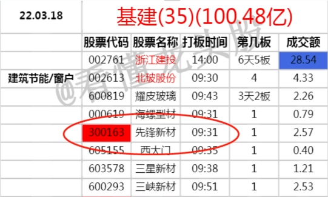
6. 举例-20220325关税豁免
    - 连板高标：富佳股份、龙头股份
    - 首板300：星徽股份
    - 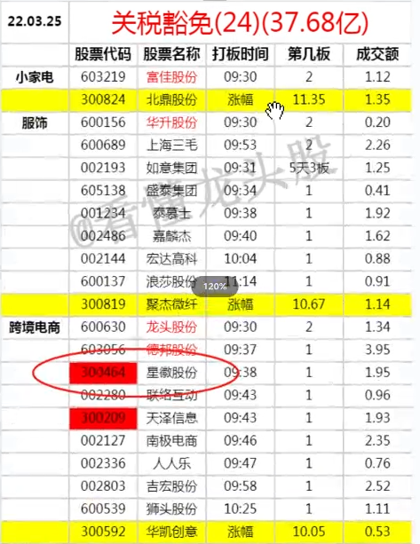
7. 举例-20220418新能源汽车
    - 连板高标：天龙股份
    - 连板梯队：华锋股份、常熟汽饰
    - 首板300：博俊科技
    - 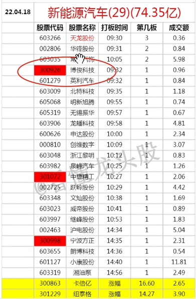
8. 举例-20220422外贸
    - 连板高标：盛泰集团
    - 连板梯队：泰慕士、龙头股份
    - 首板300：万事利
    - 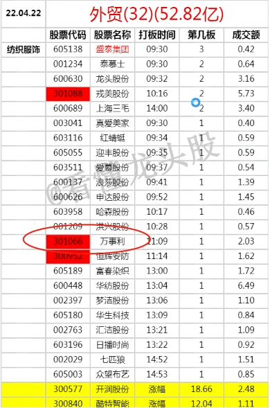

# 二、模式前提：预期板块加强
1. 板块今日已经启动，晚上复盘觉得板块逻辑上是有发展的，预判明天会发酵->爆发高潮。
2. 板块一定要是大板块，大板块才会爆发涨停潮。
3. 明天集合竞价，板块向上，正往发酵走（就是板块加强）。

# 三、模式的第一种情况：板块开盘加强
## 3.1 当晚复盘选票
1. 票在板块中辨识度高。
    - 识别度：每次炒这个概念板块，都会炒的标的。
    - 如炒房地产，300中的特发服务。
    - 如跨境电商，300中的星徽股份。
2. 小票、次新。
    - 小票：小于50亿、100亿。
    - 次新：相当于叠加次新逻辑，换了个方式炒次新。
3. 走势是超跌、止跌，缩量，最好最近没有太明显的异动。（不会有套牢盘或者埋伏盘）
4. 直接行情软件的大板块中去挑。
    - 问财搜：xx概念 创业板票 
## 3.2 明日集合竞价选票：基于性价比
1. 集合竞价出现领先于同板块其他300票的高开。（开的最高或者前排）
2. 集合开的不能太强
    - 本身又不是板块龙头，如果开的比龙头高，肯定不行。（德不配位）
    - 新股小票开太高，性价比低，愿意买的人就少了，昨日买的又会砸，买盘的势就不强，容易被砸下来。
    - 开盘后被抢上去没关系，反而证明强势。
    - 3个点最好，最多不能超过5个点。
3. 举例：20220318节能建筑-300集合竞价最高-先锋新材
    - 问财：建筑节能概念股 创业板票
    - 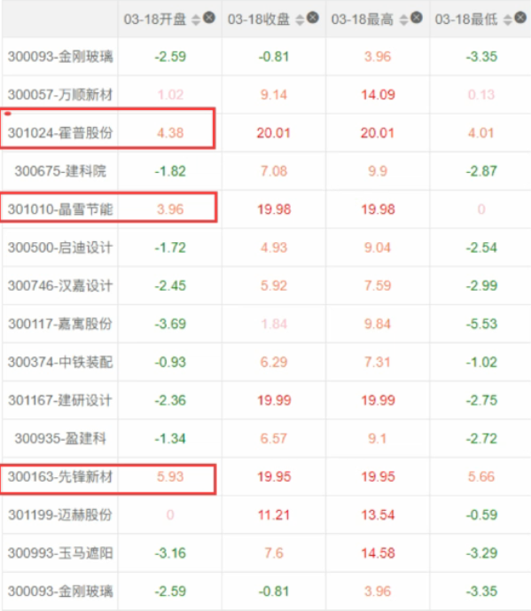
4. 举例：20220325跨境电商-300集合竞价最高-星徽股份
    - 问财：跨境电商 创业板票
    - 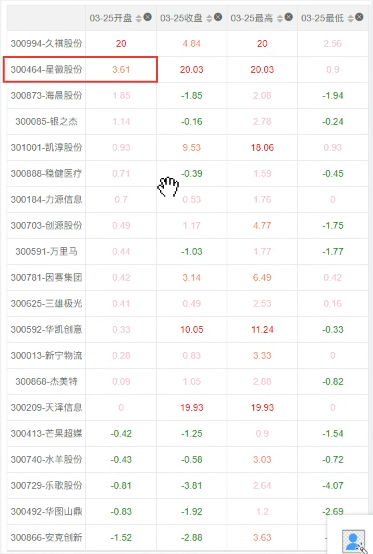
5. 举例：20220418汽车零部件-300集合竞价最高-博俊科技
    - 问财：汽车零部件 创业板票 市值小于100亿
    - 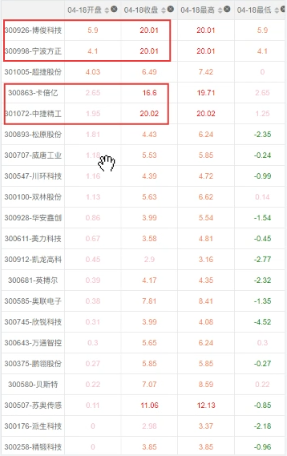
6. 举例：2022042服装纺织-300集合竞价最高-万事利
    - 问财：服装纺织 创业板票
    - 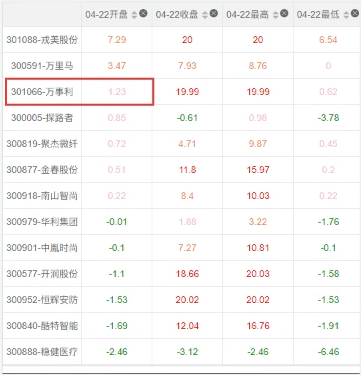
    - 万事利当天走势分析：小高开->被买上去一波->再拉一波->回落->稳住了绝得可靠->板块加强->被拉板。    
    - 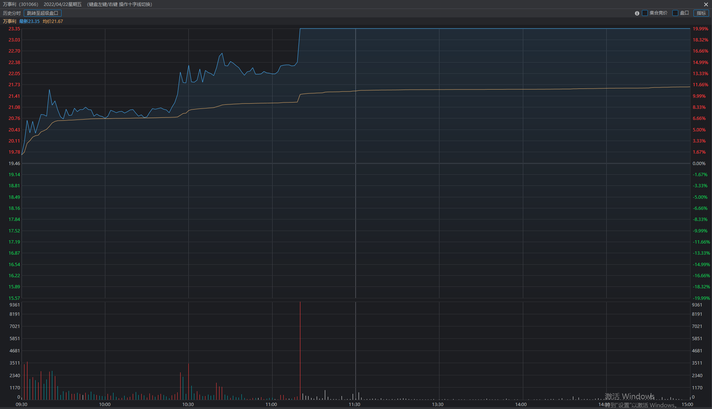
## 3.3 明日开盘看板块：有板块加强（开盘前5分钟第一波角度）
1. 板块加强
    - 开盘前5分钟第一波（09:35分），该高开的该异动的前排票，全都板了，至少是4到5个板。板块前仆后继，涨停越多越好。
    - 板块自然涨停的数量超过5个，回落的概率就不大。
    - 举例：20220318节能建筑-板块开盘加强 
    - 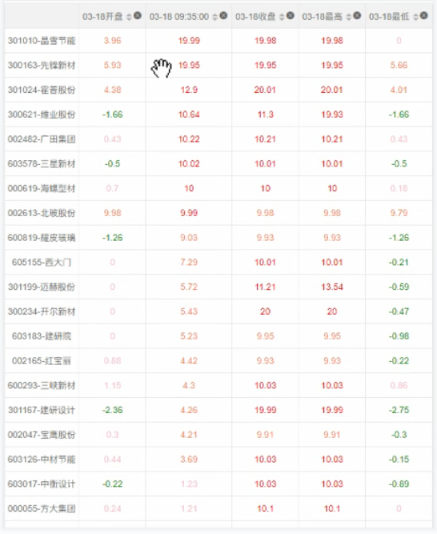
    - 举例：20220422外贸-板块开盘加强
    - 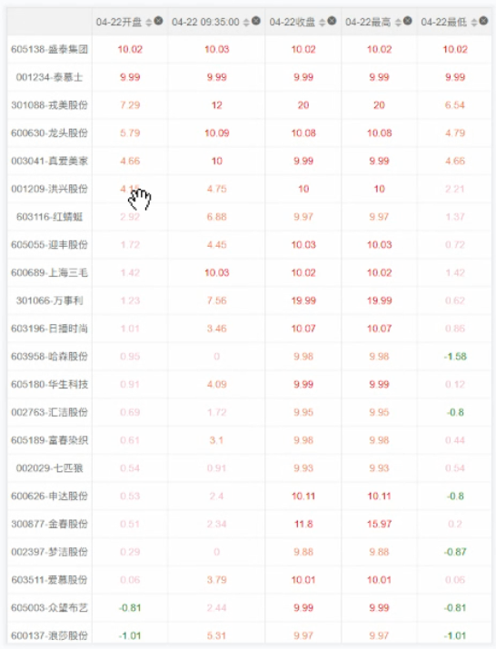
2. 脉冲
    - 最怕的是零星的拉板，后面没有跟进，这就不是加强，这是脉冲。

## 3.4 集合竞价选票-可能的坑
1. 本模式是基于性价比，在板块没有太强的情况下，出现集合乱抢，那么就是坑而不是机会了。
2. 可能会出现变种，开的最高只是参考，可能开的不是最高，但是后面卡位把开的最高的给卡了。

## 3.5 如何看待性价比
1. 临盘看板块强度，板块越强，性价比相对可以放低，板块越弱，对于套利票的涨幅限制越大。
    - 如：板块才3个涨停，300票已经冲到10cm了，不能追。
2. 一般当板块还没明确走强的时候，要限制在涨幅3-5个点以内。
    - 即使当日冲高回落到平盘，损失控制在3-5个点内。
4. 而如果板块已经明确走强了，无异动票，日内最强300票，可以考虑8个点以内。
5. 如果是反复活跃的300票，那涨幅还是限制在5个点以内。
    - 不是次新票，而是反复活跃的300票，如地产中的特发服务，很容易冲高回落，是老油子。
8. 总结：
    - 板块：大板块+刚启动未发酵+300龙头没出+开盘板块加强。
    - 个股
      - 选票：300票+超跌+止跌+缩量+次新+小票+人气辨识度
      - 开盘：小高开（不超5%，但开的最高）+开盘后向上+始终领先300同概念其他股没被卡位（算是300的龙头）
### 仓位
1. 套利票有个仓位要求，不能重仓买。更多是试探性参与。最多不要超300W。
2. 前3个符合模式的，都买一些。
### 买点
1. 这个模式第一波没有什么分时低点，只能说在涨的不够多的时候追那么一点，有点像半路追高。
### 案例
1. 20220418
    - 题材：上海复工
    - 板块：
    - 标的：博俊科技
      - 次新
      - 超跌+止跌
      - 20220415只有小异动
      - 小票（总37.3Y,流9.4Y）
    - 标的：中捷精工
      - 次新
      - 超跌+缩量
      - 小票（总22.3Y,流7Y）
2. 20220325
    - 题材：跨境电商
    - 板块：
    - 标的：星徽股份
      - 超跌+止跌
      - 辨识度高（曾当过龙头）
      - 小票（总22Y,流18.7Y）
3. 20220422
    - 题材：外贸
    - 板块
    - 标的：万事利
      - 新股
      - 小票（总22.4Y,流8.6Y）  

# 四、从板块加强的演变逻辑来看套利模式
## 4.1 板块加强的今昔对比
1. 以前：板块加强至少要1到3天的发酵，再逐步高潮，是龙头股带动板块。
2. 如今：基于突发信息启动的题材板块，当天就加强且涨停潮了。
3. 以前：游资投机是基于连板辨识度，定价权在游资。
4. 如今：量化资金投机是基于大板块的异动辨识度，定价权在量化基金。
## 4.2 板块加强底层逻辑的演变因素：互联网加快信息传播+大量的量化资金催化板块高潮
1. 信息传播快：没有预期差了，题材一异动，网络上各种股票的小表格就出来了。
2. 量化资金多：容易导致涨停潮，因为量化资金规模太大（比如幻方就是上千亿的规模），而龙头股本身资金容量有限而且加速时会缩量（容量更小），所以量化资金会基于板块去做。 
## 4.3 量化资金的特点
1. 资金大，标的容量要求大，所以会基于整个题材板块去操作，而不局限在龙头股。
    - 龙头股本身资金容量有限（单只股票），而且加速时会缩量（容量更小）。
2. 是程序化控制的，增量信息很少，大多基于存量信息，所以会从大板块去选标的。
    - 如炒基建就是装饰建筑，炒关税就是服装纺织，不用想的太复杂。
## 4.4 300套利模式的补充点
    - 在量化资金基于板块操作的背景下，实际是在套量化资金的利，所以要快。
      - 当板块有加强信号（迹象）的时候，就要有意识去找套利票。
    - 本质是板块加强后的稀缺和异动辨识度，所以标的不局限在300票。
      - 300票异动多而主板异动少，就从主板选标的，主板异动多而300票异动少，就从300票选标的。
      - 如东数西算板块加强后，300票的科蓝软件，铜牛信息，立昂技术虽然都不错，但这个板块300票异动的太多了，没有辨识度度，反而是主板没有几个异动的。
    - 套利必定讲究性价比，标的最好是超跌票，但要排除老邦菜的票（因为老邦菜每次异动都有它，稀缺度不够，不是套利模式的标的）。
    - 板块涨停潮当天，套利模式比连板后排跟风接力模式更有效。
    - 从底层逻辑上讲，基于板块加强的套利模式，更适应今后注册制20厘米甚至无涨跌停。