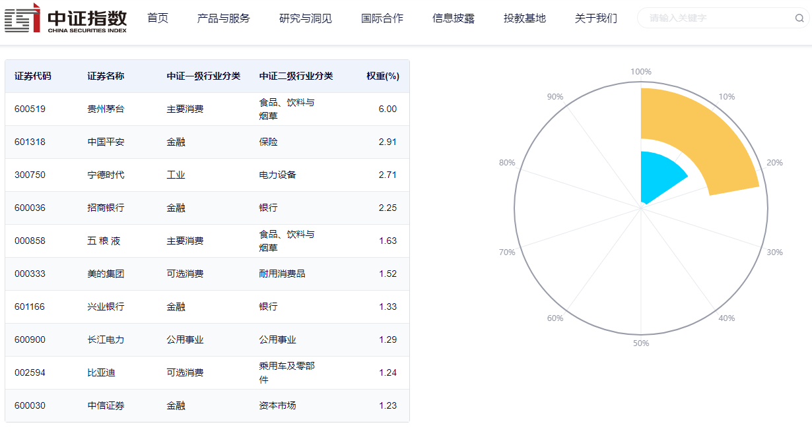
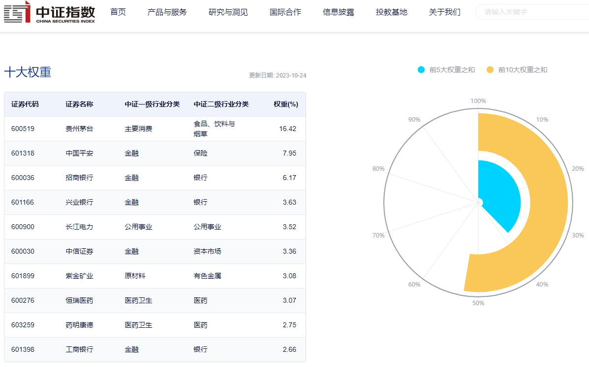

# 一、简单介绍下几个指数
## 1.1 沪深300
1. 主要由上海和深圳市场中，市值大、流动性好的300只票组成，大体上可以理解为扩充版的上证50，同时也可以理解为沪指的权重。
- 
## 1.2 上证50
1. 由沪市A股中规模大、流动性好的最具代表性的50只股票组成，主要代表的是上海市场。
2. 和沪深300指数有大多数的股票是重合的，不重合的部分在于沪深300包括了深市的票。
- 
## 1.3 中证500
1. 由全部A股中剔除沪深300成份股及总市值排名前300名的股票后，总市值排名靠前的500只股票组成。
2. 主要代表的是小市值票的情况。顺带说一下中证1000，是规模更小的1000只票，对小盘票的代表性更强。